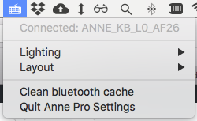
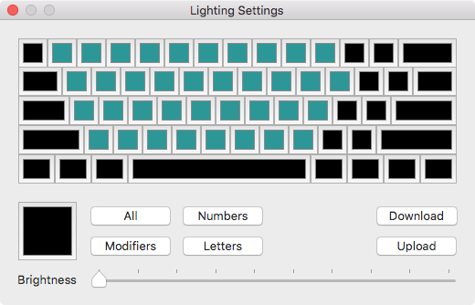
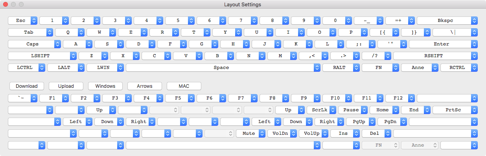

# AnnePro-mac
MacOS application for controlling AnnePro keyboard over bluetooth

This application is under development and is not yet finished. There are still problems and unimplemented features.
Please create an issue if you encounter a bug, or if you would like to see additional features.

# Installation
You can download the latest release [here](https://github.com/msvisser/AnnePro-mac/releases/latest). To install, copy the *AnnePro.app* to your Applications folder.

The first time you want to execute the app you will have to right click and choose open, this allows you to click open in 
the warning message. If you want to launch the app on boot open *System preferences* and go to *Users & Groups*. Select 
your user, under the tab *Login items* you will be able to add the *AnnePro.app*.

# Screenshots

# Known problems
- Getting keyboard to connect is all over the place. Sometimes it connects instantly, and sometimes you need to retry a lot.
- Uploading new lighting and layout information will sometimes stop halfway through. Currently the layout code will
  retry until the keyboard has the correct layout, but the lighting will not.
  
These issues are probably related to my inexperiece with the CoreBluetooth library, and creating macOS applications in general.
Please leave a pull request if you know how to fix these issues.
